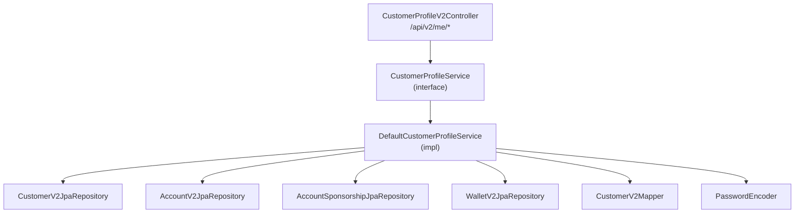

# Customer Profile V2 — Module `prometheus-service`

Migration des endpoints de gestion du profil client du module `application` (V1) vers le module `prometheus-service` (V2).

## Architecture

## Fichiers créés / modifiés

### Nouveaux fichiers (prometheus-service)

| Fichier | Rôle |
|---------|------|
| [CustomerProfileV2Controller.java](file:///home/hakon/Bureau/personal-projects/conso-epargne/prometheus-service/src/main/java/com/conso_epargne/prometheus_service/domain/customer/controllers/CustomerProfileV2Controller.java) | Contrôleur REST V2, expose les endpoints `/api/v2/me/*` |
| [CustomerProfileService.java](file:///home/hakon/Bureau/personal-projects/conso-epargne/prometheus-service/src/main/java/com/conso_epargne/prometheus_service/domain/customer/services/CustomerProfileService.java) | Interface de service définissant le contrat |
| [DefaultCustomerProfileService.java](file:///home/hakon/Bureau/personal-projects/conso-epargne/prometheus-service/src/main/java/com/conso_epargne/prometheus_service/domain/customer/services/impl/DefaultCustomerProfileService.java) | Implémentation utilisant les entités V2 |
| [CustomerProfileDTO.java](file:///home/hakon/Bureau/personal-projects/conso-epargne/prometheus-service/src/main/java/com/conso_epargne/prometheus_service/domain/customer/dto/CustomerProfileDTO.java) | DTO profil complet |
| [ChildV2DTO.java](file:///home/hakon/Bureau/personal-projects/conso-epargne/prometheus-service/src/main/java/com/conso_epargne/prometheus_service/domain/customer/dto/ChildV2DTO.java) | DTO filleul V2 |
| [CustomerChildrenDTO.java](file:///home/hakon/Bureau/personal-projects/conso-epargne/prometheus-service/src/main/java/com/conso_epargne/prometheus_service/domain/customer/dto/CustomerChildrenDTO.java) | DTO filleuls par niveau |
| [CustomerStatisticsDTO.java](file:///home/hakon/Bureau/personal-projects/conso-epargne/prometheus-service/src/main/java/com/conso_epargne/prometheus_service/domain/customer/dto/CustomerStatisticsDTO.java) | DTO statistiques réseau (typé, remplace `Map<String, Object>`) |
| [CustomerCpmDTO.java](file:///home/hakon/Bureau/personal-projects/conso-epargne/prometheus-service/src/main/java/com/conso_epargne/prometheus_service/domain/customer/dto/CustomerCpmDTO.java) | DTO CPM |

### Fichier modifié (common-service)

| Fichier | Modification |
|---------|------|
| [AccountSponsorshipJpaRepository.java](file:///home/hakon/Bureau/personal-projects/conso-epargne/common-service/src/main/java/com/conso_epargne/common_service/repositories/v2/account/AccountSponsorshipJpaRepository.java) | Ajout de `findActiveByParentId()` pour récupérer les filleuls actifs |

## Mapping des endpoints V1 → V2

| Endpoint V1 (`/api/v1/...`) | Endpoint V2 (`/api/v2/...`) | Description |
|---|---|---|
| `GET /me` | `GET /me` | Profil client |
| `GET /me/children` | `GET /me/children` | Filleuls par niveau |
| `GET /me/children/statistics` | `GET /me/children/statistics` | Statistiques réseau |
| `GET /me/cpm` | `GET /me/cpm` | CPM |
| `POST /me` | `POST /me` | Mise à jour profil |
| `POST /me/credentials` | `POST /me/credentials` | Changement mot de passe |
| `DELETE /me/dismiss` | `DELETE /me/dismiss` | Suppression compte |

> [!NOTE]
> Les endpoints wallet (`/me/wallet/*`), collecte (`/me/current-collect`), partenariat (`/me/become-partner`) et frais (`/me/fees`) n'ont **pas** été migrés. Ils pourront être ajoutés ultérieurement si nécessaire.

## Différences clés V1 → V2

| Aspect | V1 | V2 |
|--------|----|----|
| **Entité client** | `Customer` + `Account` (table unique) | `CustomerV2Entity` + `AccountV2Entity` (tables séparées V2) |
| **Réseau parrainage** | `Account.children` (`@OneToMany mappedBy parent`) | `AccountSponsorshipEntity` (table de jointure `ce_sponsorship`) |
| **Statistiques réseau** | `Map<String, Object>` non typé | `CustomerStatisticsDTO` typé avec champs dédiés |
| **Service** | `CustomerFacade` + `ConsoStatisticCalculator` (2 classes) | `CustomerProfileService` (interface unique) |
| **Wallet** | `WalletService` (V1, `PersonalWallet`) | `WalletV2JpaRepository` (V2, `WalletV2Entity`) |
